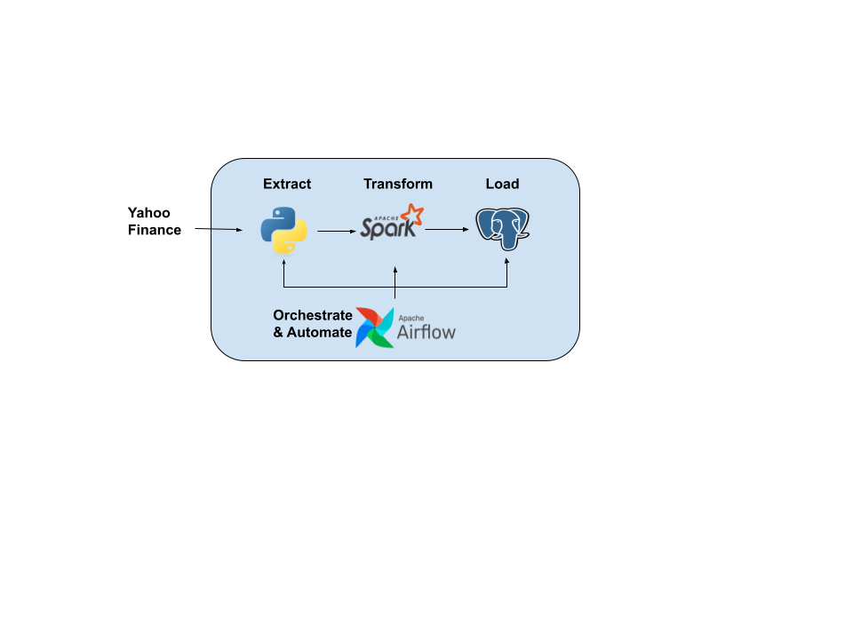
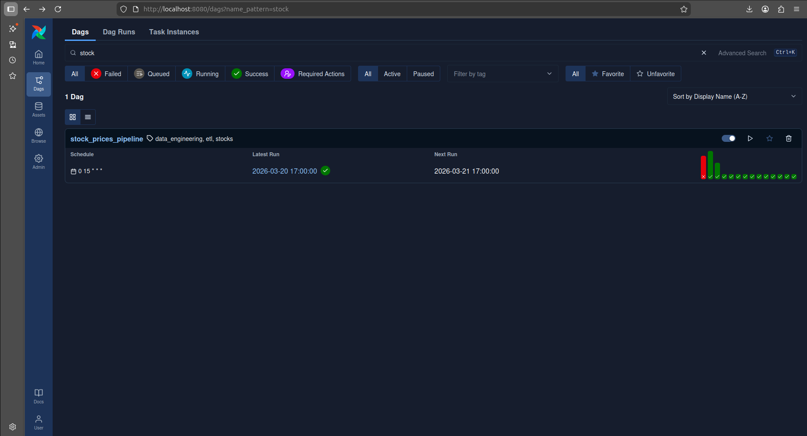
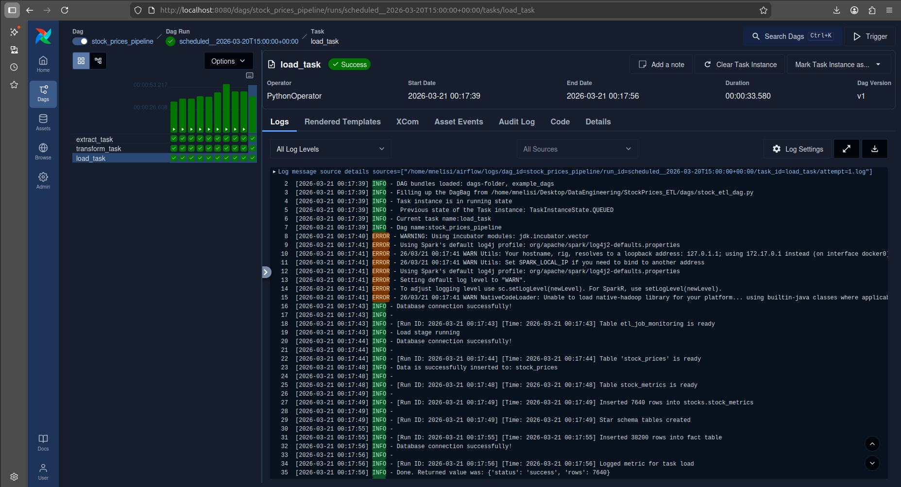
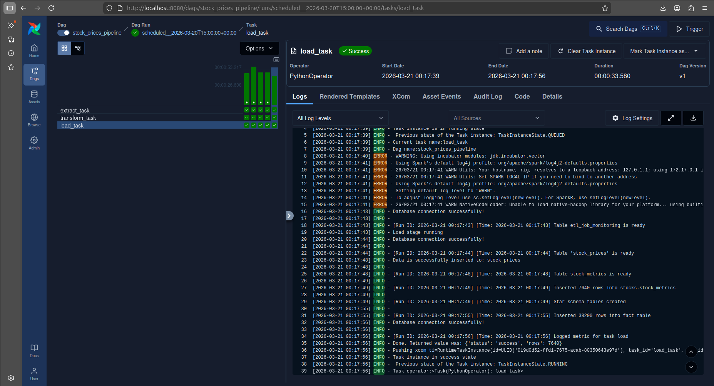
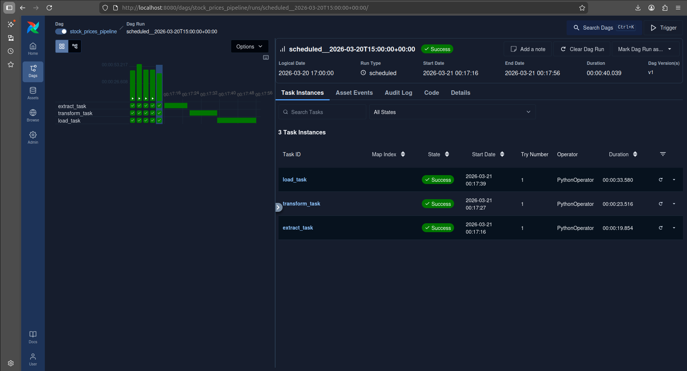
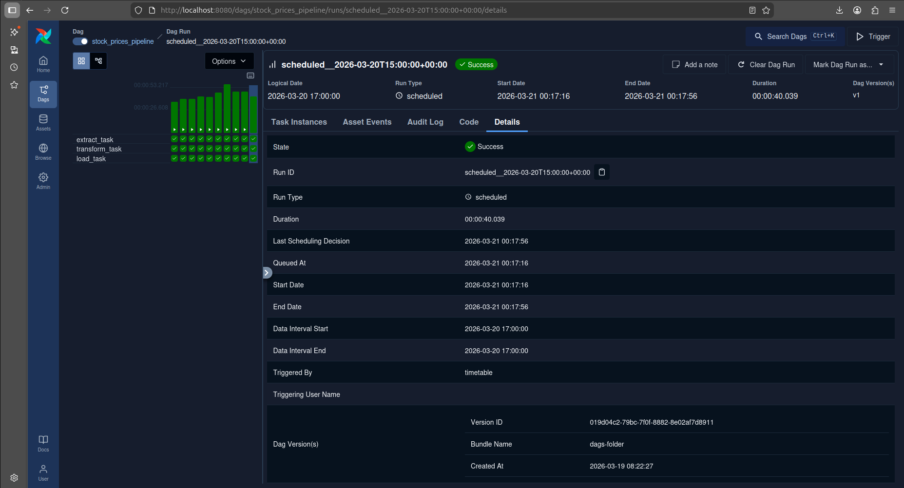

# StockPrices ETL - Big Data Engineering Pipeline

This project demonstrates a **Big Data Engineering pipeline** for stock market data. It ingests historical stock price data, computes key financial metrics, validates data quality, and stores the results in PostgreSQL.

The pipeline is built with **PySpark** for distributed computing, orchestrated using **Apache Airflow**.

## Business Value

This pipeline provides real-world value by:

* **Stock Market Analytics**
  Computes returns, volatility, and other metrics to support trading and investment decisions.

* **Scalable Big Data Processing**
  Handles large datasets using Spark, enabling efficient computations on thousands of records.

* **Data-Driven Insights**
  Historical stock data analysis supports forecasting and trend detection.

* **Operational Reliability**
  Metrics and logging ensure pipeline health, detect errors, and provide auditability.

* **Pipeline Monitoring**
  Airflow orchestration tracks task execution and performance.

## CI/CD

On every push to the `main` branch:

* Python tests (if implemented) run automatically.

## Architecture

This architecture demonstrates a production-style data pipeline using Spark for distributed processing 
and Airflow for orchestration, making it suitable for Big Data workloads.

### Explanation

This diagram represents the **end-to-end Big Data ETL pipeline**:

1. **Extract (Python)**

   * Stock data is collected using Python (e.g., `yfinance` or CSV ingestion).
   * This is the entry point of the pipeline.

2. **Transform (Apache Spark)**

   * Data is processed using **PySpark** for scalable computation.
   * Metrics such as returns and volatility are calculated.
   * Spark enables handling large datasets efficiently.

3. **Load (PostgreSQL)**

   * Transformed data is stored in a **PostgreSQL database**.
   * Includes both raw processed data and computed metrics.

4. **Orchestration (Apache Airflow)**

   * Airflow manages and automates the entire pipeline.
   * It schedules and executes tasks in order:

     Extract → Transform → Load

## ETL Pipeline with Apache Airflow

The ETL pipeline steps:

1. Extract stock data from CSV or external sources.
2. Transform using **PySpark** for distributed computations.
3. Validate the transformed data.
4. Load processed data and metrics into PostgreSQL.
5. Log execution metrics

### Airflow DAG Overview

### Airflow Task Logs

### Airflow Gantt

### Airflow Runs

## Features

* **PySpark ETL Pipeline** – Distributed computation of stock metrics for large datasets.
* **Data Validation** – Ensures correctness of stock prices, volumes, and computed metrics.
* **PostgreSQL Storage** – Stores raw and processed data with pipeline metrics.
* **Airflow Orchestration** – Automates ETL tasks with DAGs.
* **Metrics Logging** – Tracks pipeline runs and data processing results.
* **CI/CD Workflow** – Automated Docker build and tests using GitHub Actions.

## Tech Stack

* Python
* PySpark
* Apache Airflow
* PostgreSQL
* CI/CD via GitHub Actions

## Pipeline Flow

1. Extract stock data.
2. Transform and compute metrics with Spark.
3. Validate data.
4. Load into PostgreSQL.
5. Monitor and log pipeline metrics.

## Project Structure

StockPrices_ETL/
dags/                # Airflow DAGs for orchestration
data/                # Parquet, processed and raw
logs/                # Airflow and pipeline logs
pipeline/            # ETLpipeline class
ingestion/           # Data Extracttion
processing/          # Data transformation and metric computation
storage/             # Data storage and connection
screenshots/         # Airflow DAG execution, postgresql tables
venv/                # Python virtual environment
requirements.txt     # Python dependencies
README.md            # Project documentation

## Environment Variables

Create a .env file with:

DB_NAME=stocks
DB_HOST=localhost
DB_USER=postgres
DB_PASSWORD=your_password
DB_PORT=5432

## How to Run the Project

1. Clone the repository:
   git clone https://github.com/mnelisim/StockPrices_ETL.git
   cd StockPrices_ETL
2. Create a virtual environment:
3. python3 -m venv venv
   source venv/bin/activate
4. Install dependencies:
   pip install -r requirements.txt
5. Run Airflow DAGs to process the data.
   airflow standalone

## Author

Mnelisi Masilela
BSc IT Graduate | Big Data / Data Engineering Portfolio Project